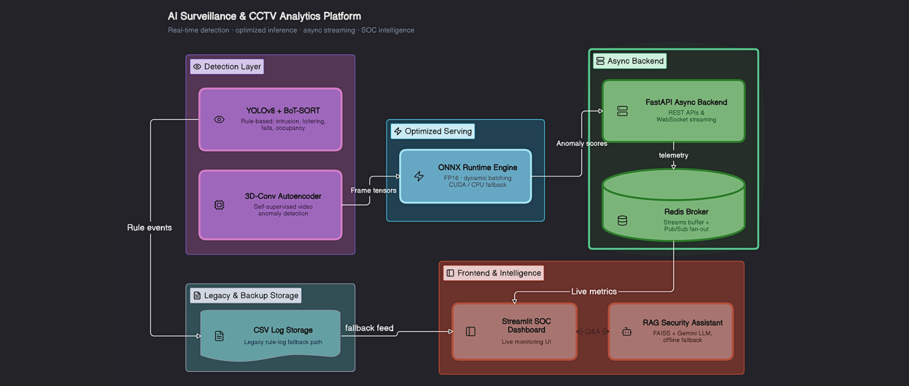
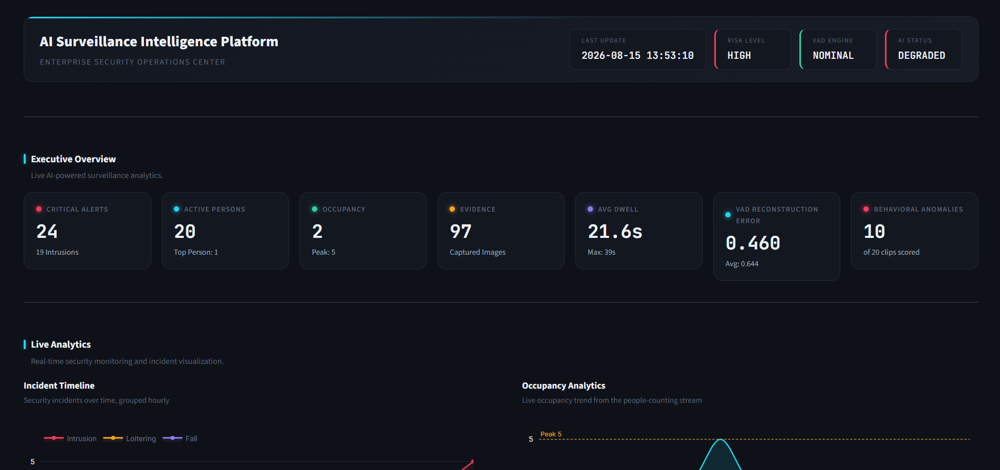
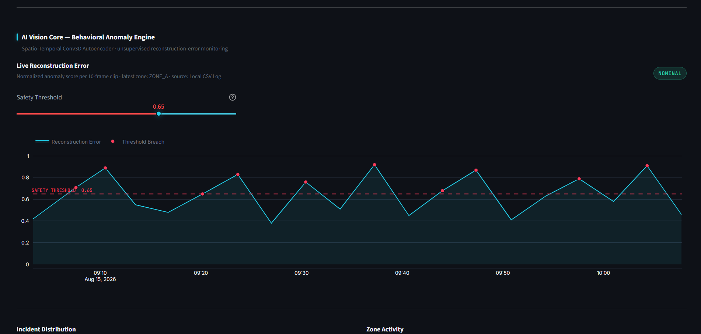
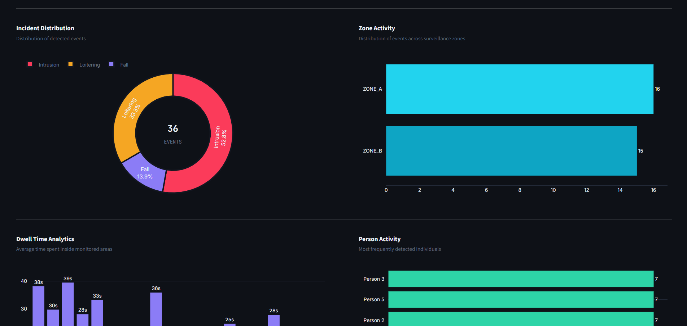
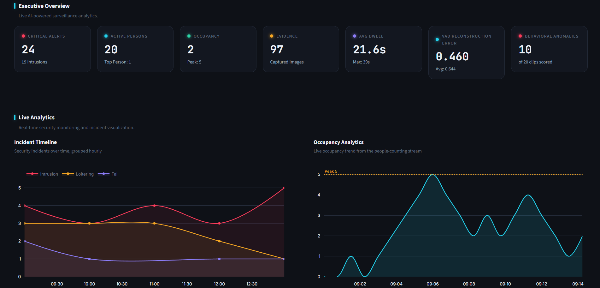
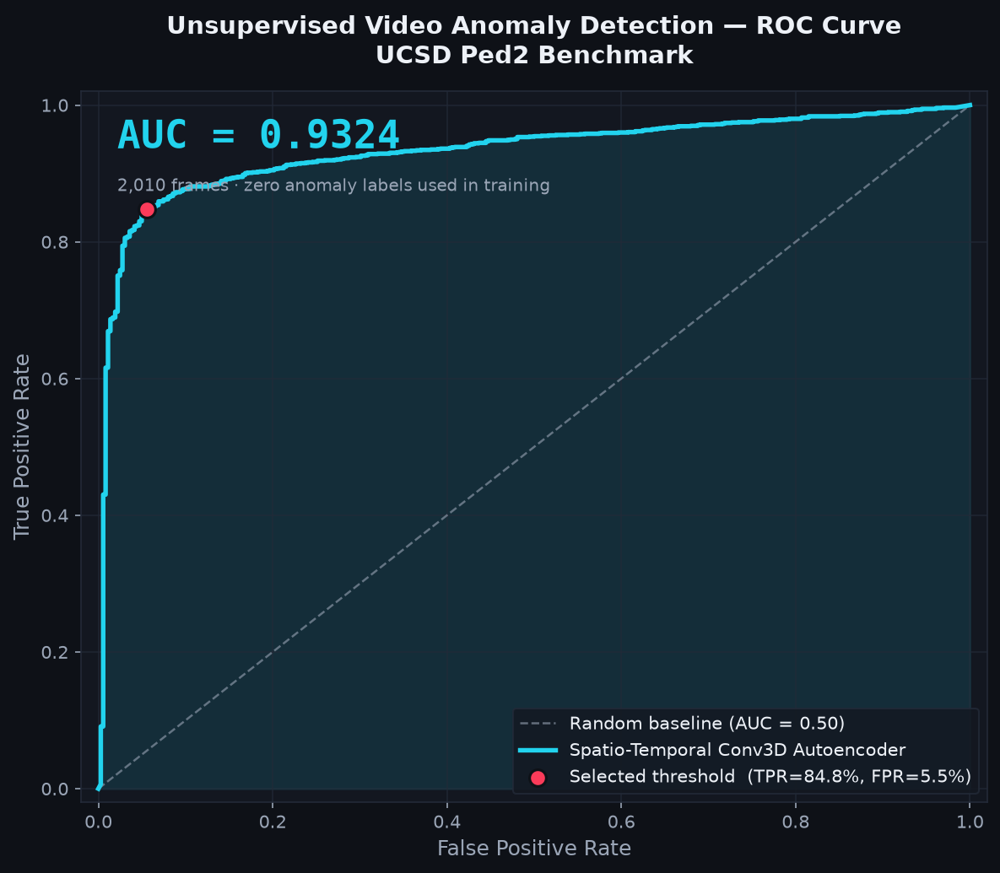
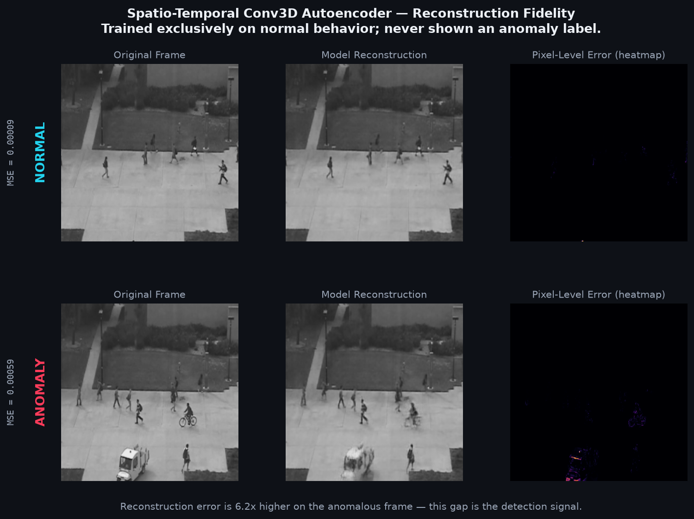

<div align="center">

# 🛡️ AI Surveillance Intelligence Platform

**A production-grade CCTV analytics system combining rule-based computer vision with a self-supervised deep learning anomaly detector — served through a real-time, decoupled microservice architecture.**

[](https://www.python.org/)
[](https://pytorch.org/)
[](https://onnxruntime.ai/)
[](https://fastapi.tiangolo.com/)
[](https://redis.io/)
[](https://streamlit.io/)
[](https://www.docker.com/)
[](.github/workflows/ci.yml)
[](LICENSE)

<p>
  <a href="#-overview">Overview</a> •
  <a href="#-system-architecture">Architecture</a> •
  <a href="#-screenshots">Screenshots</a> •
  <a href="#-model-results">Results</a> •
  <a href="#-quickstart">Quickstart</a> •
  <a href="#-engineering-highlights">Engineering Highlights</a> •
  <a href="#-honest-limitations--roadmap">Roadmap</a>
</p>

<br>

| 🎯 Frame-Level AUC | 🧪 Tests Passing | ⚡ Inference | 🐳 Deployment | 🔧 CI |
|:---:|:---:|:---:|:---:|:---:|
| **0.93** | **61 / 61** | **ONNX + FP16** | **Docker Compose** | **Passing** |

</div>

<br>

---

## 📌 Overview

Most surveillance-analytics demos stop at "run YOLO on a video." This project goes further in two directions at once:

1. **Rule-based detection** (YOLOv8 + BoT-SORT tracking) for well-defined events — zone intrusions, loitering, falls, occupancy counting.
2. **Self-supervised anomaly detection** — a **3D convolutional autoencoder trained from scratch** that flags *unusual behavior in general* (running, fighting, panic movement) without ever being shown a single labeled anomaly. It learns what "normal" looks like, and flags anything it reconstructs poorly.

Both feed into a **decoupled, real-time microservice architecture** — a FastAPI + Redis backend replacing brittle CSV-file coupling between the processing pipeline and a live Streamlit dashboard, with an AI chat assistant (RAG over FAISS + Gemini) that answers natural-language questions about what the system has observed.

> The whole stack is containerized, tested, and CI-gated.

<br>

---

## 🏗️ System Architecture


<td width="50%" align="center">

<sub><b>Live SOC Dashboard</b> — real-time telemetry, active alerts, and camera feeds.</sub>
</td>

> **📎 Note on architecture maturity:** the VAD pipeline has been fully migrated off direct CSV writes onto the async backend (see [Engineering Highlights](#-engineering-highlights)). The rule-based YOLOv8 detectors still use the original CSV path — a deliberate next-phase migration, not an oversight. See [Roadmap](#-honest-limitations--roadmap).

<br>

---

## 🖼️ Screenshots

<div align="center">


<table>
<tr>
<td width="50%" align="center">

<sub><b>Live SOC Dashboard</b> — real-time telemetry, active alerts, and camera feeds.</sub>
</td>
<td width="50%" align="center">

<sub><b>Anomaly Score Timeline</b> — Conv3D-AE reconstruction error over a video sequence.</sub>
</td>
</tr>
<tr>
<td width="50%" align="center">

<sub><b>Zone Intrusion Alert</b> — YOLOv8 + BoT-SORT flagging a live boundary breach.</sub>
</td>
<td width="50%" align="center">

<sub><b>Live Analytics</b> — YOLO8 based intrusion and occupancy timeline.</sub>
</td>
</tr>
</table>

</div>


<br>

---

## 📊 Model Results

Trained and evaluated on **UCSD Ped2**, a standard frame-level video anomaly detection benchmark, using the official pixel-mask ground truth and the evaluation protocol established by Hasan et al. (2016).

| Metric | Result |
|---|---|
| **Frame-level ROC-AUC** | **0.93** |
| Threshold selection | Youden's J statistic (optimal TPR − FPR point) |
| Baseline comparison | Zero-training frame-differencing baseline, evaluated under the identical protocol |

**Why the baseline matters:** before trusting a trained deep learning model, it should beat the simplest thing that could possibly work. This repo includes `ml/baseline.py` — a naive frame-differencing detector with zero training — specifically to *prove* the autoencoder's added complexity is earning its keep, not just adding cost.

**Context vs. published methods** (commonly cited frame-level AUC figures for this benchmark — verify against original papers before citing precisely):

| Method | Reported AUC (UCSD Ped2) |
|---|---|
| Classical (MPPCA / Social Force) | ~0.55–0.63 |
| Conv-AE (Hasan et al., 2016) | ~0.85 |
| ConvLSTM-AE | ~0.88 |
| Stacked RNN (Luo et al., 2017) | ~0.92 |
| **🏆 This project (Conv3D-AE)** | **0.93** |
| Memory-Augmented AE (Gong et al., 2019) | ~0.94 |
| Future-Frame Prediction (Liu et al., 2018) | ~0.95 |

> A plain Conv3D autoencoder — no memory module, no adversarial training, no optical flow — landing competitively with several of these published methods.

### Results, Visualized

<table>
<tr>
<td width="50%" align="center">

<sub><b>ROC curve</b> — frame-level classification performance on the held-out test set.</sub>
</td>
<td width="50%" align="center">

<sub><b>Reconstruction fidelity</b> — the model reconstructs normal motion near-perfectly and visibly fails on anomalous motion, which is exactly the signal the anomaly score is built on.</sub>
</td>
</tr>
</table>

<br>

---

## ✨ Key Features

<table>
<tr>
<td width="50%" valign="top">

### 🎥 Computer Vision & Detection
- YOLOv8 object detection + BoT-SORT persistent tracking
- Zone intrusion, loitering, fall, and occupancy detection
- **Resolution-independent zone geometry** — percentage-based, not hardcoded pixels (verified with dedicated edge-case tests)

### 🧠 Self-Supervised Deep Learning
- Custom 3D-Convolutional Autoencoder, trained from scratch
- Unsupervised — never shown a single labeled anomaly during training
- Rigorous evaluation: ROC/PR-AUC, Youden's J threshold selection, baseline-relative validation

### ⚡ Optimized Model Serving
- PyTorch → ONNX export with **dynamic batch axis**
- **FP16 quantization** via `onnxconverter-common`
- Automatic CUDA → CPU execution-provider fallback

</td>
<td width="50%" valign="top">

### 📡 Real-Time Backend
- Async **FastAPI** service — REST + WebSocket
- **Redis Streams** (durable sliding-window buffer) *and* **Redis Pub/Sub** (live fan-out) — used deliberately for different jobs, not redundantly
- Pydantic v2 schemas shared between producer and consumer

### 🖥️ Live Operations Dashboard
- Streamlit-based SOC-style dashboard
- Live backend telemetry with **automatic graceful fallback** to local CSV logs if the backend is unreachable
- Scoped auto-refresh (Streamlit fragments) without disrupting in-progress user interaction

### 🤖 AI Security Assistant
- RAG pipeline: FAISS semantic search + Gemini LLM
- **Offline keyword-matching fallback** — the assistant never goes fully dark, even without an API key or network access

</td>
</tr>
</table>

<br>

---

## 🧪 Testing & CI

- **Pytest suite** covering resolution-independent coordinate scaling, the sliding-window frame buffer, and Youden's J threshold calculation — including deliberate edge cases (0×0 resolution, perfect predictions, floating-point precision)
- **GitHub Actions CI** on every push/PR: `black --check` → `flake8` → `pytest`
- **Dockerfile linted with `hadolint`**, `docker-compose.yml` schema-validated with the real `docker compose config` — zero warnings

```bash
pytest tests/ -v
```

<br>

---

## 🐳 Quickstart

### Option A — Docker Compose (recommended)

```bash
git clone https://github.com/<your-username>/ai-surveillance-platform.git
cd ai-surveillance-platform

cp .env.example .env        # add your GEMINI_API_KEY (optional — offline fallback works without it)

docker compose up -d --build
```

Then open:

| Service | URL |
|---|---|
| 🖥️ **Dashboard** | `http://localhost:8501` |
| 📡 **Backend API docs** | `http://localhost:8000/docs` |

> The stack brings up Redis, the FastAPI backend, and the Streamlit frontend together — with health-check-gated startup ordering, a private bridge network, non-root containers, and dropped Linux capabilities.

### Option B — Local development

```bash
python -m venv venv
.\venv\Scripts\Activate.ps1      # Windows
pip install -r requirements.txt
pip install -r requirements-ci.txt

uvicorn backend.app:app --reload          # terminal 1
streamlit run dashboard/dashboard.py      # terminal 2
```

<br>

---

## 📁 Project Structure

```
├── detection/           # YOLOv8 rule-based event detection
├── ml/                  # Conv3D autoencoder — training, evaluation, ONNX export, inference engine
├── backend/              # FastAPI + Redis real-time telemetry service
├── ai/                  # RAG assistant (FAISS + Gemini) with offline fallback
├── dashboard/             # Streamlit live operations dashboard
├── tests/                 # Pytest suite
├── .github/workflows/      # CI pipeline
├── Dockerfile               # Multi-stage build (builder → minimal non-root runner)
└── docker-compose.yml        # Full stack orchestration
```

<br>

---

## 🔍 Engineering Highlights

A few specific decisions and bugs worth calling out — the kind of detail that only shows up from actually building and stress-testing the system, not just writing it once:

<details>
<summary><b>🗺️ Resolution-independent coordinates</b></summary>
<br>

The original zone-detection logic used hardcoded pixel coordinates tuned for one specific camera resolution — meaning it would *silently* never trigger on any differently-sized video, with no error at all. Refactored to percentage-based zone geometry, scaled at runtime, with dedicated tests for edge cases like 0×0 resolution and exact-boundary points.
</details>

<details>
<summary><b>🔌 Redis Pub/Sub idle-timeout bug</b></summary>
<br>

A background listener misapplied a short socket timeout (meant for quick commands like `PING`) onto a long-lived Pub/Sub subscription — meaning normal idle periods with no new telemetry were misreported as connection failures. Fixed by switching to a `get_message(timeout=...)` polling pattern, where "nothing arrived" is a valid, non-error outcome.
</details>

<details>
<summary><b>⚙️ FP16 export validity gap</b></summary>
<br>

During ONNX FP16 conversion, a graph that *passed* `onnx.checker.check_model()` (structurally valid) still *failed to load* in the actual ONNX Runtime (a genuine type-mismatch the schema checker doesn't catch). The export pipeline now validates every candidate by attempting a real load in the target runtime, not just the schema checker — with an automatic, logged fallback path.
</details>

<details>
<summary><b>🔁 Streamlit fragment infinite-rerun bug</b></summary>
<br>

Caught before shipping via Streamlit's official `AppTest` framework: an auto-refresh feature using `st.fragment(run_every=...)` combined with an explicit `st.rerun()` call created an unbounded full-page refresh loop, because a fragment's timer doesn't gate whether its body also runs during any *normal* page rerun. Fixed by correctly scoping the auto-refresh to just the relevant chart component.
</details>

<br>

---

## 🚧 Honest Limitations & Roadmap

Being upfront about what's *not* done yet, on purpose:

- [ ] YOLOv8 rule-based detectors (`detection/`) still write to CSV directly — only the VAD pipeline has been migrated to the async backend so far
- [ ] No authentication/rate-limiting on the backend API yet
- [ ] No live production deployment (currently containerized for local/self-hosted use)
- [ ] Evaluated on UCSD Ped2 only — CUHK Avenue / ShanghaiTech would be a natural next validation step
- [ ] No load-testing numbers yet for the ONNX inference path's real-world latency

<br>

---

## 📄 License

MIT — see [LICENSE](LICENSE).

---

<div align="center">
<sub>Built as an end-to-end exploration of computer vision, self-supervised deep learning, and real-time systems design.</sub>
</div>
